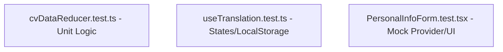

# Hướng dẫn Kiểm thử tự động (Frontend Testing Standards)

Hệ thống kiểm thử của **CV Builder** được thiết kế dựa trên tiêu chí: **Tối đa hóa tốc độ, tăng độ tin cậy và phân tách mối quan tâm tuyệt đối**. Tài liệu này hướng dẫn cách vận hành, cấu trúc và cách viết kiểm thử mới khi phát triển tính năng.

---

## 1. Stack công nghệ kiểm thử

Chúng ta sử dụng:
*   **Vitest**: Test runner siêu tốc, tích hợp trực tiếp và chia sẻ chung cấu hình biên dịch của `vite.config.ts`.
*   **React Testing Library (RTL)**: Kiểm thử các React components dựa trên hành vi thực tế của người dùng thay vì kiểm thử tiểu tiết kỹ thuật.
*   **jsdom**: Giả lập môi trường DOM trình duyệt trong Node.js.
*   **@testing-library/jest-dom**: Bổ sung các matcher trực quan như `.toBeInDocument()`, `.toHaveValue()`.

---

## 2. Câu lệnh chạy kiểm thử

Chạy các câu lệnh sau tại thư mục `/frontend`:

```bash
# Chạy toàn bộ các bài test một lần duy nhất
npm run test

# Chạy ở chế độ Live-watch (tự động chạy lại test khi bạn thay đổi code)
npm run test:watch

# Xem tỷ lệ bao phủ kiểm thử (Test Coverage Report)
npm run test:coverage
```

---

## 3. Cấu trúc 3 tầng kiểm thử & Boilerplates

Chúng ta tổ chức tệp kiểm thử nằm **ngay cạnh file mã nguồn** (`Colocated Tests`) có định dạng đuôi `.test.ts` hoặc `.test.tsx`.



### 3.1 Tầng 1: Unit Test cho State Reducer (Pure Logic)
Tất cả các thay đổi về mặt dữ liệu phải đi qua `cvDataReducer` và được bao phủ đầy đủ bằng unit test. Do là pure function, các bài test này chạy cực nhanh (dưới 10ms).

*Mẫu boilerplate:*
```typescript
import { describe, it, expect } from 'vitest';
import { cvDataReducer } from './cvDataReducer';
import { DEFAULT_CV } from '../constants';

describe('MyNewFeature Action', () => {
  it('should process MY_NEW_ACTION correctly', () => {
    const initialState = DEFAULT_CV;
    const action = { type: 'MY_NEW_ACTION' as const, payload: 'Hello' };
    const newState = cvDataReducer(initialState, action);
    expect(newState.myField).toBe('Hello');
  });
});
```

### 3.2 Tầng 2: Integration Test cho Custom Hooks
Các hook chứa logic trạng thái và đồng bộ với API hoặc Web Storage.

*Mẫu boilerplate:*
```typescript
import { describe, it, expect, vi } from 'vitest';
import { renderHook, act } from '@testing-library/react';
import { useMyCustomHook } from './useMyCustomHook';

describe('useMyCustomHook', () => {
  it('should initialize and change state', () => {
    const { result } = renderHook(() => useMyCustomHook());
    expect(result.current.value).toBe(false);

    act(() => {
      result.current.toggle();
    });
    expect(result.current.value).toBe(true);
  });
});
```

### 3.3 Tầng 3: UI Component / Interaction Test
Kiểm thử các Form Adapters bằng cách render cô lập bọc trong mock `CVEditorContext.Provider` để mô phỏng tương tác người dùng.

*Mẫu boilerplate:*
```tsx
import { describe, it, expect, vi } from 'vitest';
import { render, screen, fireEvent } from '@testing-library/react';
import { MyForm } from './MyForm';
import { CVEditorContext } from '../context/CVEditorContext';
import { DEFAULT_CV } from '../constants';

describe('MyForm Component', () => {
  const mockDispatch = vi.fn();
  const mockContext = {
    cvData: DEFAULT_CV,
    dispatch: mockDispatch,
    t: (key: string) => key,
    // ... mock các phương thức khác
  } as any;

  it('should dispatch action when user interacts', () => {
    render(
      <CVEditorContext.Provider value={mockContext}>
        <MyForm />
      </CVEditorContext.Provider>
    );

    const input = screen.getByPlaceholderText('Nhập tên');
    fireEvent.change(input, { target: { value: 'Johnny' } });

    expect(mockDispatch).toHaveBeenCalledWith({
      type: 'UPDATE_FIELD',
      payload: 'Johnny',
    });
  });
});
```

---

## 4. Nguyên tắc khi viết tính năng mới

1.  **Viết test đồng thời**: Khi tạo một Hook hoặc Component mới, hãy tạo luôn tệp `.test.ts/tsx` tương ứng nằm bên cạnh.
2.  **Mock các kết nối ngoài**: Mock API calls (`vi.mock('../services/api')`) để đảm bảo test chạy độc lập và không bị ảnh hưởng bởi mạng.
3.  **Tập trung vào hành vi**: Đối với UI, hãy test những gì người dùng nhìn thấy và tương tác (nút bấm, ô nhập liệu) thay vì test state nội bộ của component.
